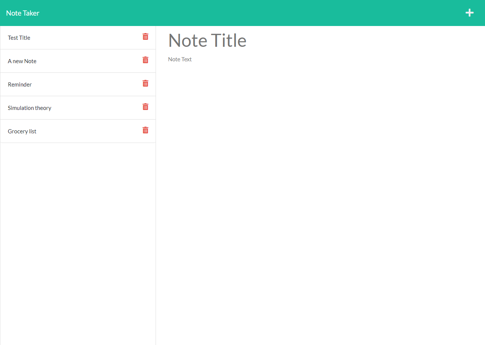

# Note Taker

## Description: 
The purpose was to is to modify starter code to create an application called Note Taker that can be used to write and save notes.

- WHEN I open the Note Taker
    - THEN I am presented with a landing page with a link to a notes page
- WHEN I click on the link to the notes page
    - THEN I am presented with a page with existing notes listed in the left-hand column, plus empty fields to enter a new note title and the note’s text in the right-hand column
- WHEN I enter a new note title and the note’s text
    - THEN a Save icon appears in the navigation at the top of the page
- WHEN I click on the Save icon
    - THEN the new note I have entered is saved and appears in the left-hand column with the other existing notes
- WHEN I click on an existing note in the list in the left-hand column
    - THEN that note appears in the right-hand column
- WHEN I click on the Write icon in the navigation at the top of the page
    - THEN I am presented with empty fields to enter a new note title and the note’s text in the right-hand column

## My contributions:
- Added server.js file which:
    - imports necessary packages and files, establishes port number, middleware for parsing data, establishes static folder, get routes to send a user to correct page, and listen route.
- Added routes foler with an index and notesRouter js files which:
    - The index.js file adds route to file to be used in server.js, this feature and file would be more advantageous with an application that has more than just one route.
    - The notesRouter.js file contains the necessary packages anf files as well as 
        - a .get route which reads the db.json file and returns all saves notes as JSON  
        - a .post route which takes the input from the notes page, saves it as a new notes and appends it to the existing array in db.json, and uses the writeFile function to write the new array to the db.json file
        - a .delete route which matches the id provided in the url as part of the :id wildcard to a note, and if it matches, it deletes the notes from db.JSON array, establishes the new array, and then uses writefile to write the new array to db.json similar to .post route (but with 1 less note).

## Table of Contents
- [Installation](#Installation)
- [Usage](#Usage)
- [Final product](#Final-Product)
- [Questions](#Questions)

## Installation: 
- Download or clone the repo from GitHub and open application once on local machine

    or
- Open the app from the link provided in README

## Usage: 
Once the note taker application is open a user can:
- Write a new note which will contain a title for the note and then the body
- Save the note which will place the saved note on the left side of the page
- Add new notes
- View old notes by clicking on the specific note on the left side of the page

## Contributing: 
There a no plans for public contribution at this time.

## Final-Product:
Here is a screenshot and link to the finished note taker:
[Link to webpage](https://nameless-woodland-76790.herokuapp.com/)

## Questions
- If you have any questions, email me at pchaze@yahoo.com
- Checkout my GitHub profile [here](https://github.com/PhalenH)

